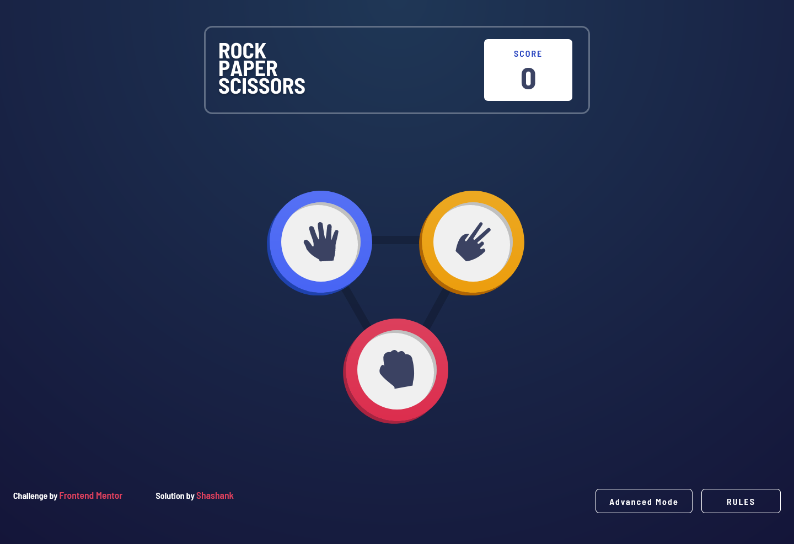
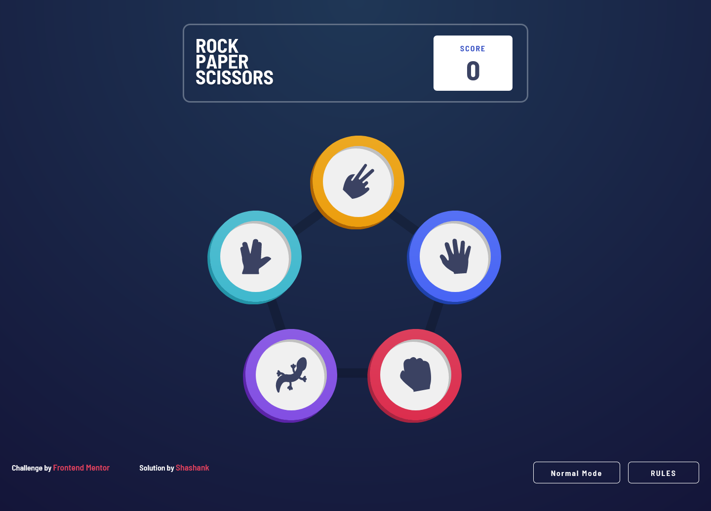
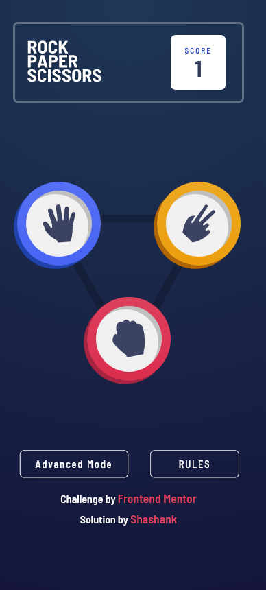
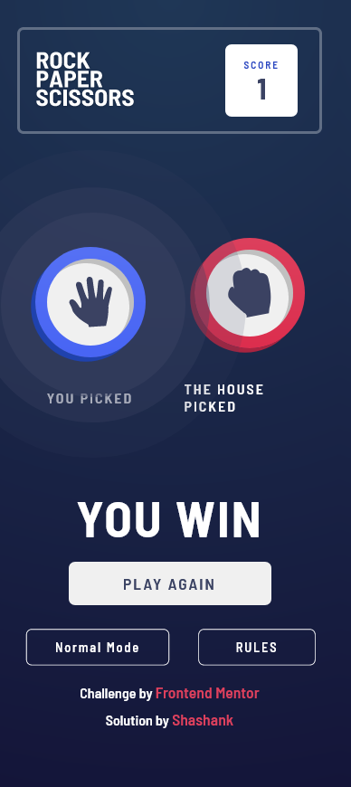

# Frontend Mentor - Rock, Paper, Scissors solution

This is a solution to the [Rock, Paper, Scissors challenge on Frontend Mentor](https://www.frontendmentor.io/challenges/rock-paper-scissors-game-pTgwgvgH). Frontend Mentor challenges help you improve your coding skills by building realistic projects. 

## Table of contents

- [Overview](#overview)
  - [The challenge](#the-challenge)
  - [Screenshot](#screenshot)
    - [Desktop layout](#desktop-layout)
    - [Mobile layout](#mobile-layout)
  - [Links](#links)
- [My process](#my-process)
  - [Built with](#built-with)
  - [What I learned](#what-i-learned)
  - [Useful resources](#useful-resources)
- [Author](#author)

## Overview

### The challenge

Users should be able to:

- View the optimal layout for the game depending on their device's screen size
- Play Rock, Paper, Scissors against the computer
- **Bonus**: Play Rock, Paper, Scissors, Lizard, Spock against the computer

### Screenshot

#### Desktop layout





#### Mobile layout





### Links

- Solution URL: [SOlution on Frontend Mentor](https://www.frontendmentor.io/solutions/completed-bonus-challenge-using-react-js-Tud1cDv0d)
- Live Site URL: [Rock-Paper-Scissors](https://rock-paper-scissors-fawn.vercel.app/)

## My process

### Built with

- Semantic HTML5 markup
- CSS custom properties
- Flexbox
- Desktop-first workflow
- [React](https://reactjs.org/) - JS library
- [Styled Components](https://styled-components.com/) - For styles

### What I learned

This challenge helped me in better understanding useState and useEffect in React. There are various parameters and conditions that are continuously changing in this challenge. So by to managing those changes and accordingly manipulating the states helped me get a good grip on react basics.

although this is very basic js but was really helpful for me.
wrong code -

```js
if ((a === "conditionA") && (b === "conditionB" || "conditionC")){
  doSomething
}
```
right code -

```js
if ((a === "conditionA") && (b === "conditionB" || b === "conditionC")){
  doSomething
}
```
### Useful resources

- [Logical Operators AND and OR with Compound if statements](https://www.youtube.com/watch?v=OLXyquuM05Q) - This helped me in properly writing multiple AND / OR logic.
- [If Else Conditionals & Switches in JavaScript](https://www.youtube.com/watch?v=vaZpDYOuprA&t=920s) - This is good tutorial to understand different logical operators in js. 

## Author

- Frontend Mentor - [@Shashank1003](https://www.frontendmentor.io/profile/Shashank1003)
- Github - [@Shashank1003](https://github.com/Shashank1003)
